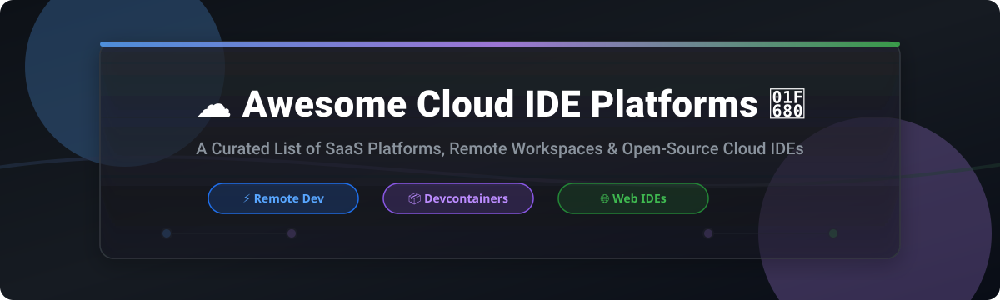

  
  
  
  
  
  

  

# ☁️ Awesome Cloud IDE Platforms 🚀

## 🌐 Top Cloud IDE Platforms & Remote Development Ecosystem

> **Curated List of SaaS Cloud IDE Products, Ephemeral Workspaces & Open-Source Remote Development Environments.** ⚡  
> *Focused on Browser-Based Development Environments, Remote Workspaces, Containerized Dev Environments, AI-assisted IDEs, Collaboration & Self-Hosted Cloud Development.*  
>
> 📅 **Last updated: September 2026**

---

## 🔍 Overview & Market Insights

This repository tracks notable **SaaS platforms** and **open-source projects** for **Cloud IDEs** (Cloud Development Environments / CDEs). These platforms provide ready-to-code environments in the browser or via remote IDE clients, featuring automated prebuilds, multi-user real-time collaboration, AI coding assistance, and seamless Git integrations.

### 📊 Cloud IDE Industry & Sector Analysis

- **📈 Estimated Market Size:** The global Cloud Development Environment (CDE) and Cloud IDE market is estimated at **~$4.2 Billion (2026)** and is projected to expand at a CAGR of **>24%**, driven by remote developer productivity demands and AI agent integration.
- **🧱 Market Structure & Fragmentation:** The sector is **moderately fragmented**, balancing hyper-scale cloud ecosystems (such as Microsoft's GitHub Codespaces) alongside high-growth specialized platforms (Replit, Coder, Daytona, StackBlitz) and robust open-source standards (`devcontainer`, Eclipse Che, Eclipse Theia).

---

## 📋 Table of Contents

- [☁️ SaaS / Hosted Cloud IDE Platforms](#-saashosted-cloud-ide-platforms)
- [🔓 Open-Source GitHub Projects](#-open-source-github-projects)
- [🤝 How to Contribute](#-how-to-contribute)
- [💖 Support & Community](#-support--community)
- [📈 Star History](#-star-history)
- [⚠️ Disclaimer](#%EF%B8%8F-disclaimer)

---

## ☁️ SaaS / Hosted Cloud IDE Platforms

| 🏢 Platform | 📝 Description | 💵 Starting Price | 🎁 Free Tier / Trial Limits | 📊 Company Size / Valuation / Revenue |
| :--- | :--- | :--- | :--- | :--- |
| **[Replit](https://replit.com/)** ⚡ | Cloud IDE and AI developer platform with instant hosting, multiplayer collaboration, and automated deployments. | **$12 / month** (Core plan) | Free Plan: Standard workspace access, 3 public Repls, 500MB storage, 0.5 vCPU limit | **~$9.0 Billion Valuation** (~$100M+ ARR) |
| **[GitHub Codespaces](https://github.com/features/codespaces)** 🐙 | Fully managed cloud dev environments integrated into GitHub with VS Code web/desktop & Copilot support. | **$0.18 / hour** (2-core compute) + **$0.07/GB/mo** storage | Free Plan: **60 hours/month** (2-core compute) & **15 GB storage/month** for all personal accounts | **Microsoft Subsidiary** ($3.2+ Trillion Corp Market Cap / GitHub ~$1B+ ARR) |
| **[JetBrains CodeCanvas](https://www.jetbrains.com/codecanvas/)** 🧠 | Enterprise cloud development environment platform engineered for IntelliJ and JetBrains remote IDEs. | **$15 / user / month** | **30-day Free Trial** (Full enterprise features, max 5 active concurrent runner instances) | **~$700 Million Revenue** (Privately held market leader) |
| **[Coder](https://coder.com/)** 🚀 | Enterprise cloud development environment platform offering Terraform-defined remote developer workspaces. | **$20 / user / month** (Enterprise tier) | Free Tier: **Community Edition free forever** (Up to 10 users, self-hosted, unlimited workspaces) | **~$400 Million Valuation** (~$64M estimated annual revenue) |
| **[StackBlitz](https://stackblitz.com/)** ⚡ | WebContainer-powered browser-native dev environment for high-speed JS/TS full-stack web applications. | **$8 / month** (Pro plan) | Free Plan: Unlimited public sandboxes, 1 concurrent container workspace, standard compute | **~$135 Million Funding** |
| **[Daytona](https://www.daytona.io/)** 📦 | Developer environment management platform specialized for standardized, secure, and scalable AI agent & developer workspaces. | **$0.05 / core-hour** (Pay-as-you-go) | Free Tier: **$10 free usage credits/month** (~200 core-hours free compute per month) | **~$24 Million Series A Raised** ($1M ARR reached in 2 months) |
| **[CodeSandbox](https://codesandbox.io/)** 🏖️ | Instant collaborative Cloud IDE for web applications and backend VM sandboxes with VS Code integration. | **$9 / month** (Pro plan) | Free Plan: Unlimited public/browser sandboxes, **40 hours VM runtime/month**, 5 team members max | **~$28 Million Total Raised** (Mid-sized tech startup) |
| **[Gitpod](https://www.gitpod.io/)** ☁️ | Automated developer environment platform providing ephemeral CDEs and self-hosted Flex infrastructure. | **$0.036 / credit** (~$18/mo starter) | Free Plan (Ona/Gitpod): 3 parallel environments max, up to 4 vCPUs / 16GB RAM / 80GB disk | **~$25 Million Total Raised** |
| **[Codeanywhere](https://codeanywhere.com/)** 🌐 | Cloud-based IDE supporting containerized remote web development environments and collaboration tools. | **$6 / month** (Basic plan) | **7-day Free Trial** (Full Basic plan access, 1 container instance, 2GB RAM) | **~$330 Thousand Revenue** (Niche cloud tool provider) |
| **[Eclipse Che](https://www.eclipse.org/che/)** 🏛️ | Open-source Kubernetes-native cloud development environments with commercial OpenShift Dev Spaces support. | **Red Hat Subscription** (Enterprise support pricing) | Free Plan: **100% Free & Open-Source** (Self-hosted on Kubernetes / OpenShift) | **Eclipse Foundation Project** (Supported by Red Hat / IBM) |

---

## 🔓 Open-Source GitHub Projects

Curated list of top open-source repositories powering self-hosted Cloud IDEs, web editors, and containerized development standards. Sorted by GitHub star count ⭐:

-  **[code-server](https://github.com/coder/code-server)** 💻  
  Run VS Code on any remote Linux server and access it directly through any browser with browser-based authentication and extension support.

-  **[Eclipse Theia](https://github.com/eclipse-theia/theia)** 🏛️  
  An extensible open-source cloud and desktop IDE framework built in TypeScript, supporting VS Code extensions and powering custom browser IDEs.

-  **[Coder](https://github.com/coder/coder)** 🚀  
  Self-hosted developer environment platform provisioned via Terraform, offering secure network tunnels, automatic idle shutdowns, and AI agent integration.

-  **[DevPod](https://github.com/loft-sh/devpod)** 📦  
  An unopinionated, client-only open-source tool for launching devcontainers on any cloud provider, Kubernetes cluster, or local Docker daemon without vendor lock-in.

-  **[Gitpod](https://github.com/gitpod-io/gitpod)** ☁️  
  Open-source developer platform for on-demand cloud development environments, prebuild automation, and devcontainer orchestrations.

-  **[Daytona](https://github.com/daytonaio/daytona)** ⚡  
  Open-source development environment manager designed to instantly set up standardized, secure developer infrastructure with a single CLI command.

-  **[Devcontainer Specification](https://github.com/devcontainers/spec)** 📋  
  Open specification defining portable devcontainer environments across GitHub Codespaces, DevPod, VS Code, and Coder.

-  **[Eclipse Che](https://github.com/eclipse-che/che)** ☸️  
  Kubernetes-native open-source cloud development environment platform for multi-user enterprise platform engineering teams.

-  **[JupyterLab](https://github.com/jupyterlab/jupyterlab)** 🔬  
  Next-generation web-based interactive development environment for notebooks, code, and data science workflows.

-  **[OpenVSCode Server](https://github.com/gitpod-io/openvscode-server)** 🌐  
  Upstream distribution of VS Code that runs on remote servers and provides access via standard web browsers.

---

## 🤝 How to Contribute

Contributions are highly welcome! Please follow these simple guidelines:

1. Fork the repository 🍴
2. Add/edit entries in `README.md` following the tabular or starred list formatting.
3. Provide accurate pricing, free tier details, and official links.
4. Submit a Pull Request with a short summary of changes 🚀

---

## 💖 Support & Community

If you find this list helpful, please consider supporting the project! 🌟

- ⭐ **Star this repository** to help others discover it.
- 🔄 **Share** with your fellow developers, platform engineers, and team members.
- ☕ **Buy me a coffee**: Support ongoing open-source curation on [GitHub Sponsors](https://github.com/sponsors/ishandutta2007).

---

## 📈 Star History

---

## ⚠️ Disclaimer

- This is a **community-curated** list — not exhaustive and not an endorsement.
- Cloud IDEs execute code remotely and process repository secrets. Always review security, data residency, and network isolation policies when deploying cloud development environments.
- Product logos and brand names belong to their respective owners.
